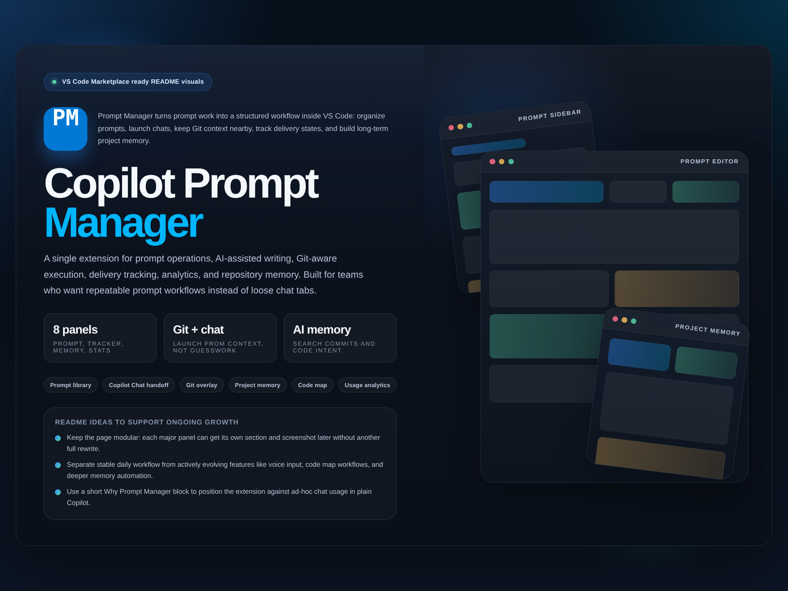
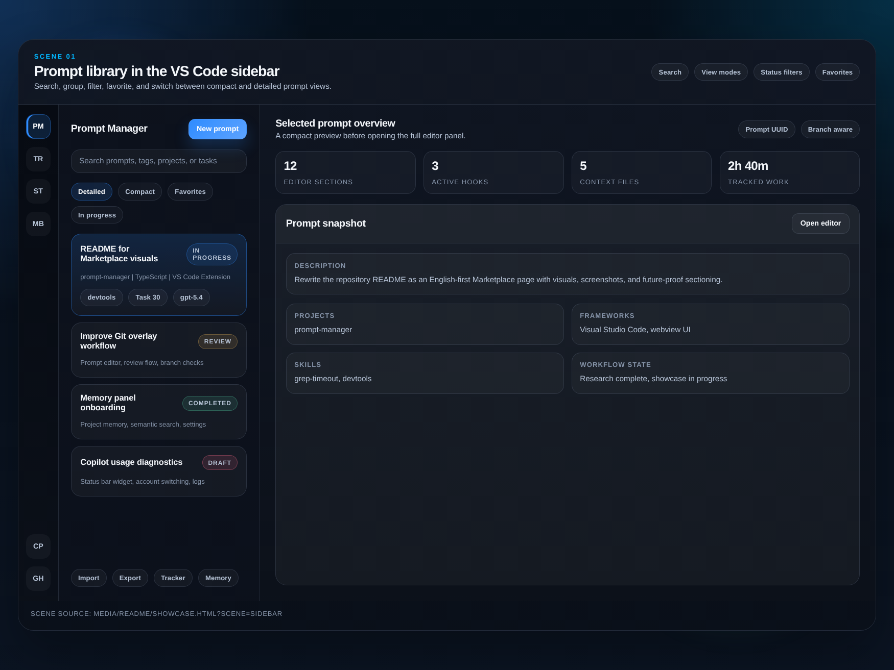
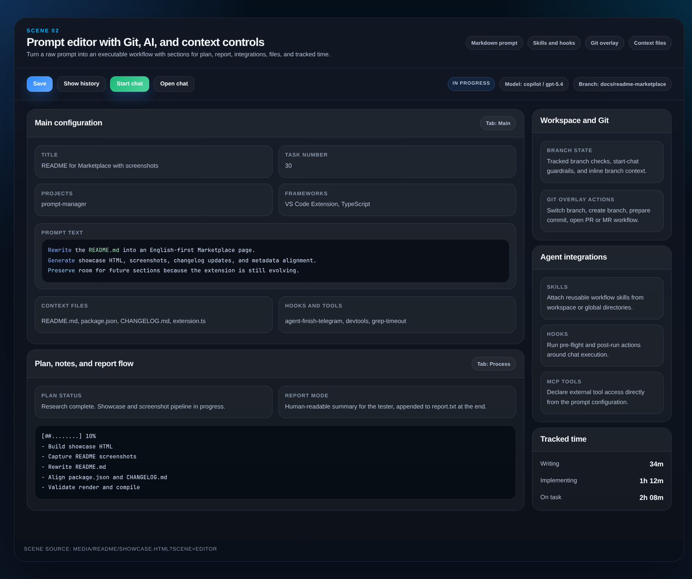
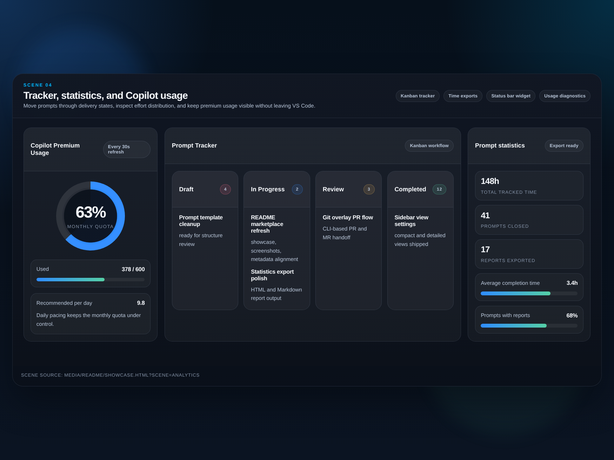
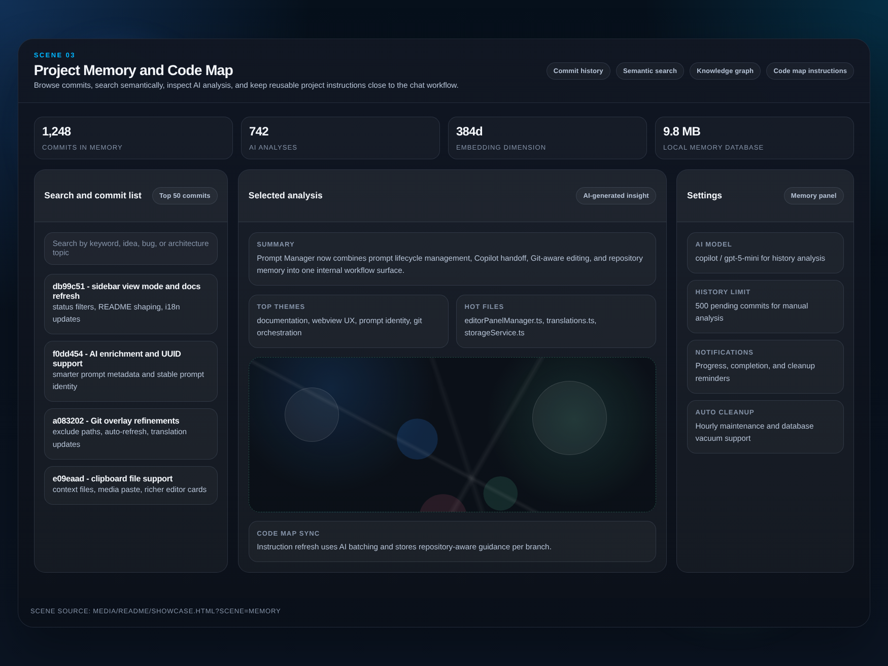

# Copilot Prompt Manager

<p align="center">
  
</p>

<p align="center">
  <strong>Structured prompt workflows for VS Code.</strong><br>
  Design prompts, launch GitHub Copilot chats, keep Git context nearby, track delivery, and build searchable project memory in one extension.
</p>

<p align="center">
  <a href="https://marketplace.visualstudio.com/items?itemName=alek-fiend.copilot-prompt-manager">Marketplace</a>
  ·
  <a href="https://github.com/atlcomgit/prompt-manager">Repository</a>
  ·
  <a href="https://github.com/atlcomgit/prompt-manager/issues">Issues</a>
</p>

<p align="center">
  
  
  
</p>

<p align="center">
  
</p>

Prompt work usually gets scattered across chat tabs, notes, branch names, and half-finished checklists. Copilot Prompt Manager turns that into a repeatable workflow inside VS Code: prompts live as project assets, chats can be started and reopened from context, Git-aware execution stays close to the prompt, and delivery surfaces like tracker, statistics, reports, and project memory stay connected.

This README is intentionally modular. The extension is still evolving, and the page is designed so new panels, workflows, screenshots, and examples can be added without another full rewrite.

## Contents

- [Why Prompt Manager](#why-prompt-manager)
- [Visual Tour](#visual-tour)
- [What You Can Do](#what-you-can-do)
- [Extension Surfaces](#extension-surfaces)
- [Installation](#installation)
- [Quick Start](#quick-start)
- [Storage and Configuration](#storage-and-configuration)
- [Actively Evolving Areas](#actively-evolving-areas)
- [Ideas for Further Expansion](#ideas-for-further-expansion)
- [License](#license)

## Why Prompt Manager

- Keep prompts as real project artifacts instead of disposable chat fragments.
- Launch GitHub Copilot chats from structured context that already knows your task, branch, files, skills, and hooks.
- Track the prompt lifecycle with eight statuses: draft, in-progress, stopped, cancelled, completed, report, review, and closed.
- Connect prompt execution with Git workflows, reports, implementation timing, and repository memory.
- Turn commit history into searchable AI-assisted memory with analysis, embeddings, and codemap-oriented context.

## Visual Tour

| Prompt Library | Prompt Editor |
| --- | --- |
|  |  |

| Project Analysis | Project Memory |
| --- | --- |
|  |  |

## What You Can Do

### Design prompts as reusable project assets

- Create, edit, duplicate, archive, import, and export prompts from a dedicated VS Code sidebar.
- Keep filtered grouped sidebar views flexible: temporary collapse changes made while filters are active do not overwrite the remembered expansion state restored after filters are cleared.
- Keep grouped sidebar results free from an extra Favorites section, while sidebar utility buttons stay light at rest and switch to a darker feedback state when active or pressed.
- Custom groups can now tint their sidebar section header with an auto-contrasted black or white title, so bright and dark group colors both stay readable.
- Busy prompts in the sidebar now show a loader instead of stale status or progress while saving or while AI is still generating title and description fields.
- Selected in-progress prompts keep the sidebar progress bar readable with an outlined inverse track, and fully completed progress uses a more saturated green fill.
- Store prompt content in Markdown and keep prompt metadata in JSON inside `.vscode/prompt-manager/`.
- Keep prompt-local context files valid after prompt title or task-number driven folder renames, including auto-repair of stale saved file references on reopen.
- Attach projects, languages, frameworks, skills, MCP tools, hooks, task references, branches, notes, plans, and reports.
- Reuse prompt context across sessions without rebuilding the same setup every time.

### Launch and reopen Copilot chats from context

- Start a GitHub Copilot chat directly from a selected prompt.
- Reopen existing chat sessions linked to the prompt.
- Reopen bound chat sessions directly by their saved session resource, without falling back to a generic empty chat when the chat view state is stale.
- Scope prompt-bound chat discovery to the current workspace storage, so prompts do not accidentally attach to Copilot sessions from another open project.
- Stop an in-progress bound chat from the prompt editor, even after the conversation has been rebound to its saved chat session.
- Rename bound chat sessions both right after the session is first attached during chat launch and later after prompt title or task number changes, even if the prompt id was renamed in the meantime, keep retrying the live chat title refresh across the early launch timing window without waiting for a VS Code reload, and show that rename as a dedicated fourth step in the Process launch block.
- Hide the Process launch block as soon as a bound or reopened chat entry is already available again, so restored chat state does not stay stuck on the opening step.
- Keep the prompt editor page from failing into a blank webview when Process-tab chat-launch UI regressions happen during the initial render path.
- Suppress the false launch-timeout notice when the new chat session appears in tracked request state slightly later than in the early session index.
- Keep each visible launch stage on screen for up to one second before the next stage appears, including the initial prepare and auto-load rows, so fast launch progress stays readable from the first step to the last one.
- Prevent the launch block from flashing again later for the same launch when background sync briefly loses and then restores the bound chat-entry signal or the same prompt is reidentified by a later id/UUID normalization step.
- See a clear explanation above the action buttons on every editor tab when Start Chat is temporarily disabled because the prompt is empty, metadata is still generating, or chat launch is already running.
- See Go to chat on every persisted prompt status except Draft and Closed, so reopening the bound Copilot chat stays available outside the initial draft stage.
- See the selected AI model directly in the Process tab launch step, so the opening step confirms which model will be used.
- Reuse the AI model from the most recently updated prompt when you create a draft through Quick Add Prompt, so quick capture starts with the same model you used last.
- Include prompt file paths, the chat-memory directory, and generated memory instruction file references in the chat start context, including dedicated project instructions stored in chat-memory when present.
- Keep generated global, project, session, and codemap instruction files as plain Markdown without auto-injected `applyTo` frontmatter.
- Resolve generated session and codemap chat-memory instructions against the current workspace: valid prompt project selections stay scoped, while empty or stale selections fall back to all workspace projects.
- Rebase embedded codemap markdown headings under per-project sections so generated instruction files keep a single top-level H1 and stable nested H2/H3/H4 structure.
- Let prompt auto-complete wait for terminal result markers from the persisted Copilot chat session, so plan-mode or still-streaming chats do not jump to Completed just because the session index already has an end timestamp.
- When a prompt is moved back to In Progress manually or by reopening chat, auto-complete now waits for the next chat request that starts after that status change, so an older completed request in the same bound chat session does not immediately flip the prompt back to Completed.
- Keep best-effort prompt refresh, model refresh, and git overlay debounce timers detached from the Node event loop, so short-lived test and utility runs do not hang waiting for delayed background retries.
- Open, switch, and status-save prompt editor pages faster: the editor shows request-aware loading immediately, paints prompts before slower metadata hydration, keeps silent chat-time refresh off the visible progress line, keeps status-change saves on cached report/base prompt state instead of report.txt refreshes and prompt rereads, skips pending report persist waits and slug/id recalculation for already-open prompts, avoids unchanged prompt.md/report.txt writes and stable report/context file probes for status-only saves, writes stable status-only config updates through a short synchronous local file write, ends the visible save indicator before slower post-save sync work, uses a direct existing-prompt id/UUID path before any broader prompt-list scan, and keeps startup Copilot usage/account refresh from blocking the first prompt save.
- See prompt switches clearly even when loading is fast: the editor now shows blank fixed-height sections for the target prompt before the real data appears, captures the latest rendered block heights before switch/save/close, reuses the latest queued snapshot immediately, avoids duplicate ready/open refreshes after prompt id changes, keeps layout state separated by prompt UUID plus prompt id, and persists those layout snapshots through an async queue to avoid sudden layout jumps without visible skeleton bars. Prompt-loading messages no longer block target prompt loading, real section measurements wait for the first post-open layout pass to settle, saved section heights are held as exact border-box locks while data appears, very fast prompt payloads wait for a short minimum blank-state window, switch placeholders now show the existing centered overlay loader immediately within the prompt form shell, the Workspace branch list keeps its per-prompt expanded or hidden state, the Process tab keeps report auto-resize suspended during open-lock, the Plan section keeps its saved blank height until the async plan snapshot arrives, and Process placeholders no longer add a Memory block when the target prompt has no saved Memory section height. Debug logging includes layout heights, branch-list state, plan hydration, and prompt switch timings for diagnosis.
- Keep the prompt editor as a single reusable VS Code page: duplicate editor webview tabs are closed automatically even if an older tab was restored or lost from the extension's internal panel tracking.
- Keep the prompt, report, and editor state tied to the same workflow instead of splitting them across tools.

### Work with Git without leaving the prompt flow

- View, switch, and create branches in workspace projects.
- Guard branch actions with dirty-worktree checks.
- Surface dirty workspace projects in Git Flow step 1 even when they are not yet attached to the prompt.
- Hide selected generated or noisy paths from the Git Flow step 1 “Changes in other projects” block with `promptManager.gitOverlay.otherProjectsExcludedPaths`, without changing the selected prompt projects themselves.
- In large workspaces, keep Git Flow faster by calculating the full overlay state only for the selected prompt projects, while neighboring repositories in the “Changes in other projects” block are loaded separately through a lighter snapshot path that now short-circuits fully clean peer repositories before the heavier change scan; peer-only auto-refresh updates also reuse that lighter path.
- Keep the first visible Git Flow payload out of the slow-path with a two-phase open: selected projects first render from a lightweight branch-first summary snapshot that defers review setup/request detection and skips extra recent-history loading, change groups, and local/remote branch enumeration on the first paint, and only then hydrates the full selected-project details and lazy “Changes in other projects” data.
- Keep the first Git Flow opening cycle resilient to webview lifecycle churn: the overlay session now preserves a short callback history for the same panel, so a follow-up visibility sync does not invalidate an already-ready summary snapshot before it reaches the webview.
- Keep the first full selected-project hydrate focused on branch and change data: review setup/request detection now lands afterward through lightweight per-project patches, and the review step stays pending until that background hydration finishes.
- Keep the first full selected-project hydrate off the branch-enumeration slow path too: local/remote branch metadata and cleanup candidates are now hydrated afterward through lightweight per-project patches, and branch-dependent controls show a loading state until that data arrives.
- Keep those review follow-up patches narrow too: Git Flow now reuses the existing project snapshot and resolves only review state for `open-review`, instead of recomputing branch and change metadata a second time.
- Keep Git Flow opening visually stable too: the webview now receives the snapshot phase explicitly and masks stale open data with loader cards and a compact summary loader until the next snapshot and automatic branch/review hydration are ready, while refresh keeps the current step content visible and shows only the header progress line.
- Keep step 1 clean-state hints stable during open and refresh by waiting for hydrated tracked-branch metadata before showing “nothing to commit” messages.
- Keep the second-phase Git Flow hydrate lighter too: selected and peer project change lists now open without per-file diff enrichment, clean repositories short-circuit before extra diff commands, and file-level metrics are hydrated lazily only when a specific project card is expanded.
- Keep bulk multi-project Git Flow actions responsive by running independent fetch, sync, push, review-request, and commit operations with controlled parallelism while preserving deterministic project ordering in the UI results.
- When `promptManager.debugLogging.enabled` is enabled, Git Flow writes duration metrics for selected snapshots, lazy other-project snapshots, refresh, bulk git operations, and per-project full-hydrate stages such as local branches, remote branches, and lightweight change scans into the existing debug log stream for easier before/after comparisons.
- Keep Git Flow visually scoped to the active prompt: switching prompts now resets step state instead of reusing the previous prompt’s section data, and reopening the overlay auto-collapses completed sections that no longer contain warnings.
- Keep the Git Flow Done action consistent with Save by persisting the final derived prompt status before the overlay closes.
- Keep branch references and task metadata near the prompt itself.
- Use the Git-oriented editor flow to support commits, review preparation, and related prompt execution.

### Track delivery, not just prompt writing

- Move prompts through a full lifecycle in the tracker panel.
- Change a prompt status directly from the sidebar item menu, including the More button and the context menu.
- Review the Process tab in workflow order with notes first, then the plan, and the report after that.
- See the current prompt status directly inside the Process tab Notes section: it is shown in the section header and again at the top of the block, using the same compact color treatment as the sidebar prompt list.
- New prompts always open on the Main tab with Basic, Time tracking, Workspace, Prompt,
  and Agent expanded by default, Notes starts collapsed but reopens automatically when it
  receives content before any manual toggle, and Plan and Report now also reopen when they
  were manually toggled while still empty and content appears later, while non-empty sections
  keep respecting later manual collapse changes, Start Chat waits for title and description
  enrichment to finish, and prompt folders stay stable after chat start while the Process tab
  only shows launch progress until the chat binding is actually unfinished.
- Open plan and report content through consistent inline Open actions across the prompt editor.
- Edit shared agent context and a dedicated project instructions file directly from the General instruction block, and open both from the editor without leaving the workflow.
- Let Start Chat refresh the shared agent context automatically when the field is still remote-backed or has been reset to empty, keep manual edits as an explicit freeze on that snapshot until you load it again yourself, and see the current auto-load state directly in the Process tab while chat launch is running.
- See a clear “No others” marker in Git Flow step 1 rows where the expected branch field is hidden because there are no alternative target branches to choose from.
- Track writing time, implementation time, overall time on task, and untracked corrections.
- Let the report editor expand to the content automatically without blanking the webview when the section opens, keep that height in sync when the editor width changes, and avoid clipping the bottom of long reports, while a new Start Chat run clears the previous plan after the launch preflight succeeds.
- Closing the separate report editor right after Save now keeps the latest edits by flushing any still-unsynced local report state before the window goes away.
- Open statistics and export delivery-friendly summaries in HTML or Markdown.
- Auto-fill report hours from working days in the selected period, persist the hourly rate per workspace, and omit hour or cost sections when those values are empty or zero.
- Keep reports inside the prompt workflow instead of treating them as a separate afterthought.

### Build project memory from real repository history

- Start on a dashboard-first Memory landing page with a shared visual layout, top-level navigation for Dashboard, Histories, Instructions, and Settings, and at-a-glance metrics for coverage, storage, activity, authors, files, and recent histories.
- Open the Project Memory panel to browse commits, file changes, and stored analysis.
- Run AI-powered history analysis with configurable models and a dedicated background priority control that defaults to the new `lowest` mode.
- Use semantic search over embeddings to find similar work by meaning, not just by text.
- Inspect knowledge-graph style relationships and code-oriented instruction snapshots.
- Manage history-memory and codemap-instruction options from one unified Settings screen with internal tabs instead of jumping between separate settings views.
- Refresh codemap instructions from the instructions view with locale-specific persistence, selected-branch delta snapshots that stay tied to the branch you actually chose, and a default `lowest` priority tuned to stay closer to idle CPU time.

### Monitor Copilot usage inside VS Code

- See Copilot Premium request usage in the status bar.
- When the saved GitHub session becomes stale or invalid, the status bar now switches to an explicit sign-in error state instead of showing inflated fallback usage numbers.
- During startup, cached usage state is reused while background refreshes settle, and the status bar does not immediately run account-summary auth checks when cached usage is available, so prompt editor saves are not held behind Copilot usage/account diagnostics.
- Open a detailed usage panel with quota signals, refresh health, and account binding diagnostics.
- Keep usage awareness close to the same workflow where prompts and chats are executed.

## Extension Surfaces

| Surface | What it does | Best used for |
| --- | --- | --- |
| Prompt Sidebar | Prompt list, search, filters, grouping, favorites, compact/detailed views | Navigating and organizing prompt inventory |
| Prompt Editor | Main prompt workspace with content, context, integrations, files, notes, plans, reports, and timing | Day-to-day prompt preparation and execution |
| Tracker | Kanban-style lifecycle view across prompt statuses | Delivery flow and prompt handoff |
| Statistics | Aggregated time and status analytics with export support | Reporting and review summaries |
| Project Memory | Commit browsing, AI analysis, semantic search, statistics, settings | Recalling prior implementation work |
| Copilot Usage | Status bar widget and detailed quota diagnostics | Monitoring Premium request consumption |
| About / Settings | Extension details and configuration access | Maintenance and onboarding |

## Installation

### From the VS Code Marketplace

1. Open the Extensions view in VS Code.
2. Search for **Copilot Prompt Manager**.
3. Click **Install**.
4. Open the Prompt Manager icon from the Activity Bar.

### Requirements

- VS Code `1.95+`
- GitHub Copilot Chat for the chat-centered workflow
- Git-enabled workspace folders for branch-aware features
- Optional: Project Memory enabled in settings when you want AI-assisted repository memory features

## Quick Start

1. Open **Prompt Manager** from the Activity Bar.
2. Create a new prompt from the sidebar.
3. Use Quick Add Prompt from the PM icon in the editor title actions near the tab bar when you want to paste raw prompt text into a new draft and let the extension auto-fill title and description in the background.
4. Fill in the brief: title, description, workspace projects, languages, frameworks, branch, task number, and AI model.
5. Add prompt content in Markdown and attach context files if needed.
6. Save the prompt and launch GitHub Copilot Chat directly from the editor.
7. Use the tracker and statistics panels to move the task forward and keep reporting aligned.
8. If you want long-term recall, open **Project Memory** and start building repository history into a searchable assistant layer.

## Storage and Configuration

Prompt Manager keeps prompts in your workspace so they can travel with the repository.

```text
.vscode/prompt-manager/
├── my-prompt/
│   ├── config.json
│   ├── prompt.md
│   ├── report.txt
│   ├── plan.md
│   ├── context/
│   └── history/
└── another-prompt/
    ├── config.json
    └── prompt.md
```

Example `config.json` shape:

```json
{
  "id": "marketplace-readme-refresh",
  "title": "README for Marketplace visuals",
  "status": "in-progress",
  "projects": ["prompt-manager"],
  "languages": ["TypeScript"],
  "frameworks": ["Visual Studio Code", "vscode extension"],
  "skills": ["grep-timeout", "devtools"],
  "taskNumber": "30",
  "branch": "feature/readme-marketplace",
  "model": "gpt-5.4",
  "contextFiles": ["README.md", "package.json"]
}
```

Useful configuration ideas:

- Keep skills and hooks curated so repeated workflows stay consistent.
- Use branches and task numbers to connect prompts with delivery artifacts.
- Keep reports and plans with the prompt so review context stays local to the repository.
- Use `promptManager.gitOverlay.otherProjectsExcludedPaths` when Git Flow step 1 should ignore generated folders or path prefixes in the “Changes in other projects” block.
- Enable Project Memory when your repository history is valuable enough to search semantically.

## Actively Evolving Areas

The extension already covers a broad daily workflow, but some surfaces are still expanding and should be treated as evolving capabilities rather than a fixed end state.

- Voice-assisted prompt input and transcription workflows
- Codemap-oriented instruction refresh and project structure guidance
- Deeper report generation and review handoff workflows
- More advanced automation around project memory and repository analysis

## Ideas for Further Expansion

These are product-direction ideas, not promises. They are listed here because the README is meant to grow with the extension.

- Team prompt packs and shared workflow presets
- Prompt comparison views across multiple AI models
- Release-focused prompt templates for review, changelog, and reporting flows
- Stronger memory-to-prompt suggestions based on commit similarity and code areas

## License

MIT © alek

<p align="center">
  Built for VS Code teams who want prompt work to be reviewable, repeatable, and project-aware.
</p>

